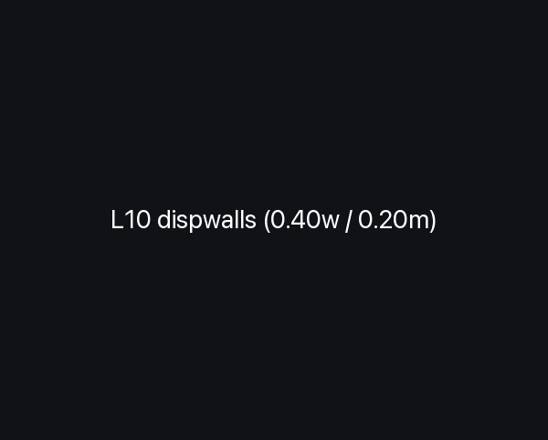
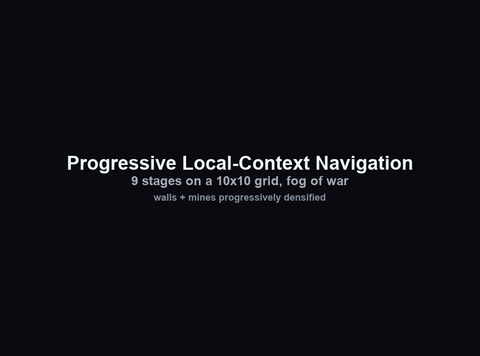
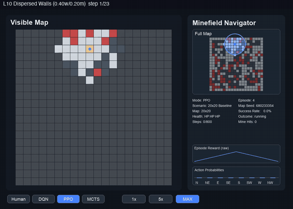
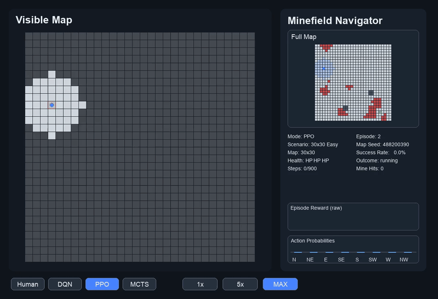
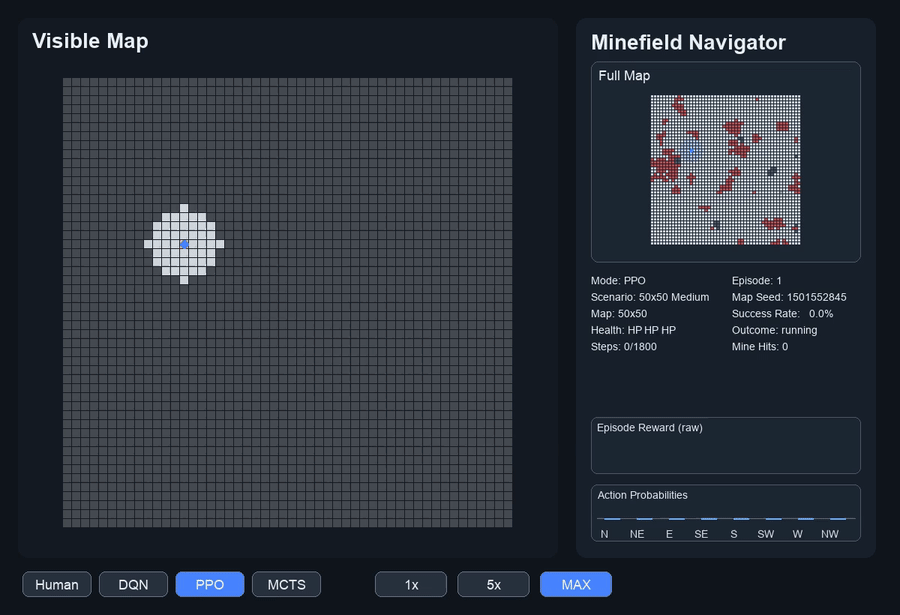
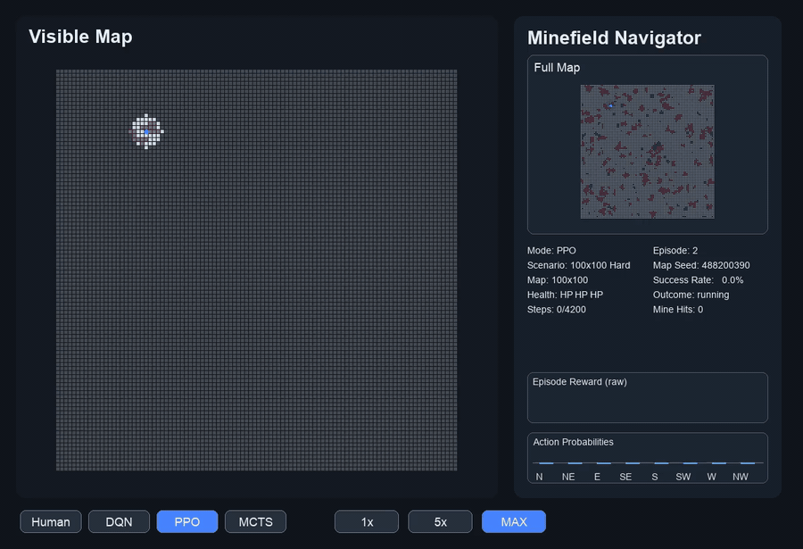

# Minefield Navigator RL

Minefield Navigator RL is a procedural navigation project for partially observable grid worlds. The agent sees only a local circular window, has limited health, must reason around walls and mines, and is trained with a staged pipeline that combines imitation learning, recurrent PPO, and PPO-compatible MCTS-guided GRPO fine-tuning.

The environment is Gymnasium-compatible and fully procedural per episode. Each generated map is BFS-validated so there is always at least one valid path from start to exit.

## Demo

### Mine = instant death: GRPO best on 20x20 dispersed (every step shown)


The same recurrent policy fine-tuned at `max_health=1`, so a single mine hit terminates the episode. IL warm-starts from the L13 PPO best (20x20 dispersed), then PPO+GRPO push the agent to navigate every dispersed profile without ever stepping on a mine. One frame per environment step at 1 fps. Per-profile success after GRPO: L10_dispwalls 0.68, L11_dispmines 0.66, L12_dispextreme 0.90, L13_dispopen 0.48 (50 episodes each, full mine death). Reproduce with `python tools/run_finetune_minedeath.py` (warm-starts from the 20x20 L13 PPO best).

### Progressive curriculum: 9 stages on a 10x10 grid, fog of war


A single agent learns local-context navigation across nine progressively harder distributions on a 10x10 grid. Each stage adds one nuance — open goal-seeking, mine avoidance, corridor mazes, mined mazes, dense walls, dense mines, then a final mixed generalist trained with PPO + GRPO. Every stage warm-starts from the previous stage's PPO best, so prior skill carries forward.

Final L9 (Generalist + GRPO, 0.30-0.40 wall density mixed with 0.20-0.30 mine density) reaches 92-100% success per profile across L1 through L8. Reproduce with `python tools/run_progressive10.py` followed by `python tools/run_progressive10_extension.py`.

### Dispersed-mode 20x20: every step shown


The same agent, retrained through L10–L13 on a 20x20 grid with the new `dispersion: dispersed` map mode (walls and mines sampled uniformly at random, no cellular-automaton smoothing or flood-fill clustering). The 9x9 view is grid-size-agnostic, so the L9 GRPO weights from 10x10 transfer cleanly. One frame per environment step at 1 fps so you can read the local view between every move. Reproduce with `python tools/run_progressive20_dispersed.py` (warm-starts from the L9 GRPO checkpoint).

### Easy: 30x30


### Medium: 50x50


### Hard: 100x100


## Highlights

- Procedural map generation with BFS path validation and safe fallback maps
- Partial-observation environment with fog of war, health, dense shaping, and anti-loop penalties
- Recurrent policy backbone: CNN encoder plus GRU memory
- Behavior cloning from an expert shortest-path planner with mine costs
- Recurrent PPO baseline
- PPO-compatible MCTS-guided GRPO fine-tuning
- Curriculum runner for `30x30 -> 50x50 -> 100x100`
- Progressive 9-stage curriculum on a 10x10 grid that gradually densifies walls and mines and warm-starts each stage from the previous PPO best
- Dispersed map mode (uniform-random walls and mines) for testing the policy on layouts without corridor or mine-cluster structure
- Grid-size-agnostic policy: the same 9x9-view weights transfer from 10x10 training to 20x20 evaluation and fine-tuning
- Pygame renderer with local-view panel plus persistent full-map preview
- Rollout export to GIF and MP4

## Environment

- Observation: `(2, 9, 9)` egocentric local window
- Actions: 8-directional movement, with no diagonal corner cutting
- Health: 3-hit survival model over persistent mines
- Rewards: progress shaping, mine penalties, living cost, invalid move penalties, revisit penalties, loop penalties, and terminal rewards
- Map generation: fully procedural, BFS-validated every episode

## Training Pipeline

The intended progression is:

1. `Imitation learning`
   Learn a reasonable navigation prior from the full-map expert planner.
2. `Recurrent PPO`
   Fine-tune the GRU policy directly in the environment.
3. `GRPO + MCTS`
   Use search-improved action targets and group-based policy optimization for stronger local decision-making.
4. `Curriculum`
   Progress from `easy` (`30x30`) to `medium` (`50x50`) to `hard` (`100x100`).

## Project Layout

```text
minefield_rl/
  env/         # Environment, map generation, fast snapshots
  models/      # DRQN, RPPO, MCTS
  planning/    # Expert planner used for imitation learning
  training/    # PPO, imitation, GRPO, curriculum runner
  eval/        # Evaluation and rollout rendering
  viz/         # Pygame UI, charts, overlays
  configs/     # Training and scenario config

assets/        # Curated demo GIFs tracked in git
```

## Installation

### Editable install

```bash
python -m venv .venv
source .venv/bin/activate
pip install --upgrade pip
pip install -e .
```

### Requirements file

```bash
python -m venv .venv
source .venv/bin/activate
pip install --upgrade pip
pip install -r requirements.txt
```

After installation you can use either `python -m minefield_rl` or the console entry point `minefield-rl`.

## Quickstart

### Play a checkpoint

```bash
minefield-rl --mode play --agent ppo --checkpoint path/to/checkpoint.pt --scenario easy
```

### Evaluate a checkpoint

```bash
minefield-rl --mode eval --agent ppo --checkpoint path/to/checkpoint.pt --scenario medium --episodes 100
```

### Run imitation learning

```bash
minefield-rl --mode train --agent ppo --imitation --scenario easy
```

### Run recurrent PPO fine-tuning

```bash
minefield-rl --mode train --agent ppo --checkpoint path/to/checkpoint.pt --scenario easy
```

### Run GRPO + MCTS fine-tuning

```bash
minefield-rl --mode train --agent ppo --grpo --checkpoint path/to/checkpoint.pt --scenario easy
```

### Run the full curriculum

```bash
minefield-rl --mode curriculum --agent ppo --device cpu --output-prefix minefield_rl/logs/curriculum_run
```

### Render a rollout to GIF and MP4

```bash
minefield-rl --mode render --agent ppo --checkpoint path/to/checkpoint.pt --scenario hard --output-prefix minefield_rl/logs/hard_rollout
```

## Scenario Presets

| Scenario | Grid Size |
| --- | --- |
| `easy` | `30x30` |
| `medium` | `50x50` |
| `hard` | `100x100` |

You can also override the map size directly with `--map_size`.

## Notes

- The codebase is CPU-oriented and keeps the default networks relatively small.
- Logs and checkpoints are intentionally excluded from version control.
- The bundled GIFs are curated artifacts copied from local rollouts.
- `50x50` and `100x100` remain much harder than `30x30`; the included demos are representative runs, not a claim that the task is solved.

## Verification

Basic validation used for packaging:

```bash
python3 -m compileall minefield_rl
.venv/bin/python -m minefield_rl --help
```

## License

MIT
