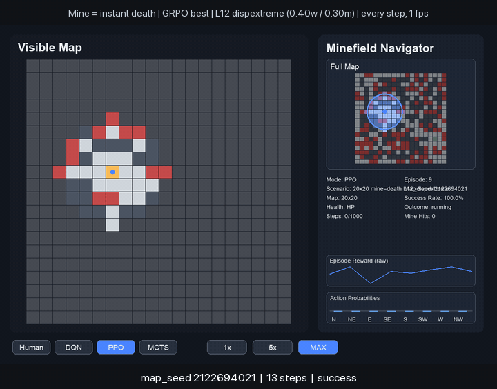

# Minefield Navigator RL

## Problem

A small agent has to cross a procedurally generated 2D minefield from a start cell to an exit cell. The world is hard for three reasons stacked together:

- **Partial observability.** The agent only sees a 9×9 egocentric window. Anything outside that local circle is unknown — including the goal until it gets close. The full map is never an input.
- **One-hit-kill mines.** The map is salted with mines that are only visible inside the local window. In the headline configuration `max_health = 1`, so a single mine step ends the episode. The agent has to infer "is this cell safe?" from local geometry plus whatever it remembers about cells it just saw.
- **Procedural and dispersed.** Every episode is a new layout. Walls and mines are sampled uniformly at random across the grid (no corridor structure to lean on). Each map is BFS-validated so a safe path always exists, but it is rarely obvious from the local view.

The combination is what makes the task a real test of local-context reasoning. A reactive policy that just follows a heuristic gradient will eventually walk onto a mine; a memoryless policy will loop in dead ends; a non-recurrent policy will forget the mine it just saw two steps ago. The agent has to do all three jobs at once: navigate, remember, and avoid catastrophe — using only what fits inside a 9×9 patch.

## Solution

A small recurrent actor-critic (CNN encoder → GRU memory → health-conditioned trunk → actor/critic heads) trained in three stacked stages, then walked through a multi-stage curriculum that ends in a mine-is-death fine-tune.

1. **Imitation learning** from an A* expert that plans over `(row, col, health)` with a mine-cost penalty. At `max_health = 1` the planner refuses to step on any mine, so demonstrations are strictly mine-free.
2. **Recurrent PPO** in the environment, warm-started from the IL checkpoint. This is where the GRU learns to *use* the memory — remembering recently-seen mines, escaping dead ends, calibrating value under partial observability.
3. **GRPO + MCTS** for the final polish. Short MCTS rollouts produce search-improved action targets in exactly the regime where one local mistake is fatal.

The whole stack is then walked through a curriculum (10×10 clustered → 10×10 dispersed → 20×20 dispersed → mine = instant death). Every stage's PPO/GRPO best feeds the next stage's IL as `initial_checkpoint`, so prior skill carries forward instead of being overwritten. The 9×9 view + small CNN is the structural reason the curriculum works: the input shape never changes when the grid does, so weights transfer cleanly across grid sizes.

## Best result



20×20 dispersed extreme (0.40 wall density, 0.30 mine density), `max_health = 1`. **Success rate 0.90 over 50 evaluation episodes** (death rate 0.08, average remaining health 0.92). One frame per environment step at 1 fps so every move and every mine in view is legible.

## Architecture

```text
                       Observation (per env step)
              ┌──────────────────────────────────────────┐
              │   obs : (2, 9, 9)        health : (1,)   │
              │   ch0 = walls/free       in [0, 1]       │
              │   ch1 = mines (visible)                  │
              └──────────────────────────────────────────┘
                              │
                              ▼
              ┌──────────────────────────────────────────┐
              │ CNN encoder   (egocentric, 9×9 patch)    │
              │   Conv2d(2 → 16, 3×3, pad=1) + ReLU      │
              │   Conv2d(16→ 32, 3×3, pad=1) + ReLU      │
              │   Conv2d(32→ 32, 3×3, pad=1) + ReLU      │
              │   Flatten → Linear(32·9·9 → 256) + ReLU  │
              └──────────────────────────────────────────┘
                              │  features (256)
                              ▼
              ┌──────────────────────────────────────────┐
              │ GRU memory   hidden_size = 256, 1 layer  │
              │   reset on episode_starts mask           │
              └──────────────────────────────────────────┘
                              │  rnn_out (256)
                              ▼              ┌──────────┐
                concat ◀──────────────────────│ health(1)│
                              │              └──────────┘
                              ▼
              ┌──────────────────────────────────────────┐
              │ Post-health trunk                        │
              │   Linear(257 → 128) + ReLU               │
              └──────────────────────────────────────────┘
                    │                              │
                    ▼                              ▼
        ┌────────────────────┐         ┌────────────────────┐
        │ Actor head         │         │ Critic head        │
        │ Linear(128→64)+ReLU│         │ Linear(128→64)+ReLU│
        │ Linear(64 → 8)     │         │ Linear(64 → 1)     │
        │ → action logits    │         │ → state value V(s) │
        └────────────────────┘         └────────────────────┘
                    │
                    ▼
              8-way move (N, NE, E, SE, S, SW, W, NW)
                  no diagonal corner-cutting
```

## Training strategy

```text
   ┌─────────────────────────────────────────────────────────────────┐
   │                       Training pipeline (per stage)             │
   │                                                                 │
   │  ┌──────────────────┐   ┌──────────────────┐   ┌──────────────┐ │
   │  │ 1. Imitation     │   │ 2. Recurrent PPO │   │ 3. GRPO+MCTS │ │
   │  │ Learning (BC)    │──▶│ on-policy in env │──▶│ search-guided│ │
   │  │                  │   │                  │   │ policy update│ │
   │  │ A* expert with   │   │ GAE, clipped     │   │ KL-anchored  │ │
   │  │ mine-cost plans  │   │ ratio, value MSE │   │ to PPO trunk │ │
   │  │ → (s,a,return)   │   │ + entropy bonus  │   │ MCTS targets │ │
   │  │ → BC + value MSE │   │                  │   │ over groups  │ │
   │  └──────────────────┘   └──────────────────┘   └──────────────┘ │
   │          │                       │                     │       │
   │          └────warm-start ────────┼─────warm-start ─────┘       │
   │           ckpt model_state_dict only (architecture invariant)  │
   └─────────────────────────────────────────────────────────────────┘

                       Curriculum (each stage = full pipeline above)

   10×10 clustered (CA-smoothed walls + flood-fill mines)
   ┌────┬────┬────┬────┬────┬────┬────┬────┬────┐
   │ L1 │ L2 │ L3 │ L4 │ L5 │ L6 │ L7 │ L8 │ L9 │
   │open│mine│maze│mine│dens│dens│ext │ext │GEN │
   │    │d-op│    │maze│wall│mine│remel│remm│+GRPO│
   └─┬──┴────┴────┴────┴────┴────┴────┴────┴──┬─┘
     │                                         │
     │  warm-start L9 GRPO  →  scale grid/mode │
     ▼                                         ▼
   10×10 dispersed (uniform-random walls/mines, no clustering)
   ┌────┬────┬────┬────┐
   │ L10│ L11│ L12│ L13│      same 9×9-view weights, no retraining
   │d-w │d-m │d-x │mix │      of the CNN/GRU shape needed
   └────┴────┴────┴────┘
                 │
                 ▼  warm-start L13 GRPO  → grid 10 → 20
   20×20 dispersed
   ┌────┬────┬────┬────┐
   │ L10│ L11│ L12│ L13│
   └────┴────┴────┴────┘
                 │
                 ▼  warm-start L13 PPO  → max_health 3 → 1
   20×20 dispersed, MINE = INSTANT DEATH        ◀── headline result
   ┌──────────────────────────────────────────┐
   │ IL  →  PPO  →  GRPO  on mixed dispersed  │
   │ per-profile eval + slow-step rendering   │
   └──────────────────────────────────────────┘
```

Why each piece earns its keep:

- **Imitation** boots the policy to a competent prior in minutes; PPO from scratch on the dispersed extreme profile would spend most of its budget on random-walk dying.
- **PPO** lets the agent discover behaviors the expert can't teach: detours that exploit the GRU memory of recently-seen mines, anti-loop maneuvers in dense walls, and value calibration under partial observability.
- **GRPO + MCTS** uses short search-improved rollouts as a teacher signal in regions where one local mistake is fatal — exactly the regime mine = instant death lives in.
- **Curriculum + warm-starts** — every distribution shift (clustered → dispersed, 10×10 → 20×20, health 3 → 1) reuses prior weights instead of starting over. The 9×9 view + small CNN is the structural reason this works: the input shape never changes.

## Project layout

```text
minefield_rl/
  env/         # Environment, map generation, fast snapshots
  models/      # Recurrent PPO actor-critic, MCTS, DRQN
  planning/    # A* expert with health-aware mine cost
  training/    # imitation, PPO, GRPO trainers
  eval/        # batch evaluation and rollout rendering
  viz/         # pygame UI, charts, overlays
  configs/     # base config.yaml

tools/         # curriculum orchestrators, fine-tunes, render scripts
assets/        # demo media tracked in git
```

## Installation

```bash
python -m venv .venv
source .venv/bin/activate
pip install --upgrade pip
pip install -e .
```

## License

MIT
